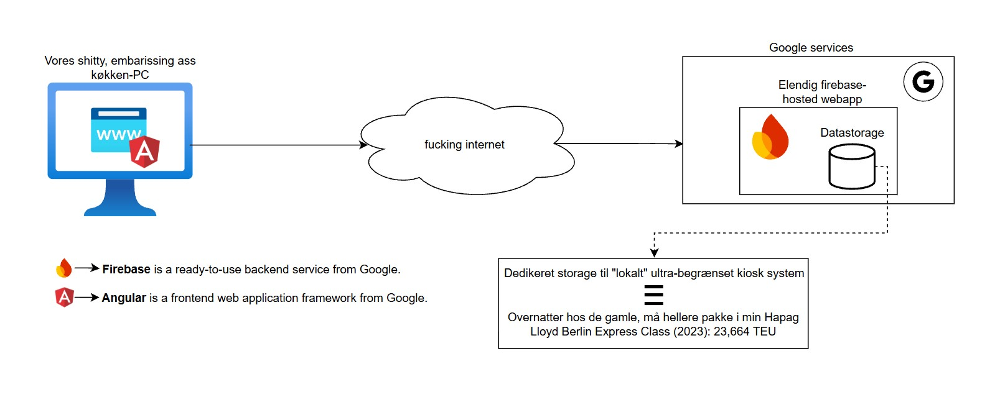
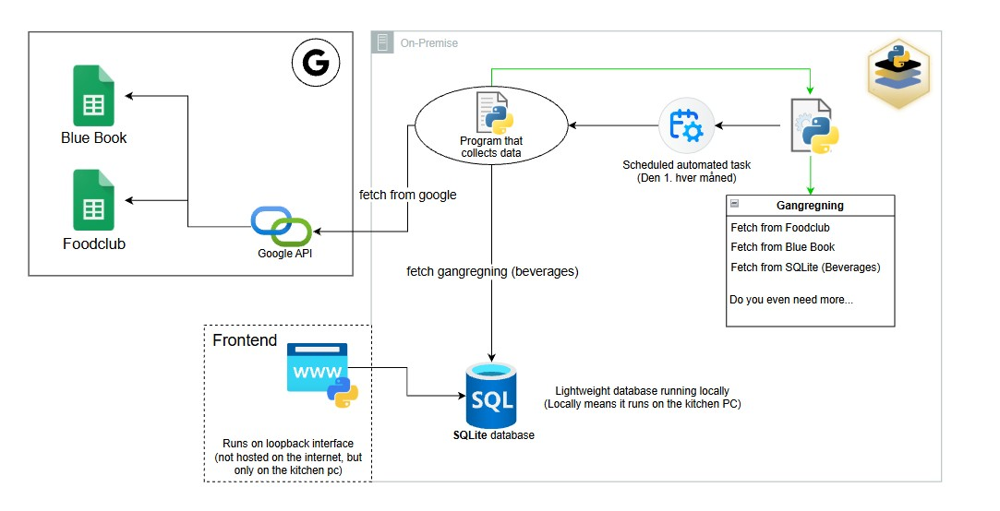

# hallway-accounting


Kollegianeren is a local, self-hosted kiosk and accounting application. It replaces the dependency on the old internet-hosted Angular/Firebase solution with a Python web server, a browser frontend, and a local SQLite database running on the kitchen PC.

> [!IMPORTANT]
> This repository contains only the new system. The old Angular/Firebase system shown below is included for historical context; none of its application code, Firebase storage, or hosting configuration is part of this repository.

## System overviews

### Old/current system — external legacy system

The legacy system runs an Angular web application through Firebase and requires an internet connection. This diagram describes the system being replaced, not software contained in this repository.



### New system — architecture of this repository

The proposed replacement runs locally on the kitchen PC. The browser frontend communicates with the Python server, which stores kiosk data in SQLite and combines it with Foodclub and Blue Book data fetched through the Google Sheets API.



The scheduled monthly task in the diagram represents the target automation. The repository currently provides the generation operation through the Admin page and API; scheduling that operation with the host operating system is a deployment step and is not configured in this repository.

## Architecture

The system has four main parts:

- **Browser frontend:** `app/frontend/` provides the kiosk, product, resident, accounting, calendar, and admin views.
- **Local Python backend:** `app/backend/` serves the frontend, exposes the HTTP API, calculates accounting totals, and connects to Google Sheets.
- **Local data:** `kollegianeren.db` stores residents, products, and purchases. Files in `data/` provide seed and schedule data.
- **Maintenance tools:** `scripts/` contains database setup, historical import, reporting, and diagnostic utilities.

The frontend is available only through the local server by default. Google access is outbound: accounting and calendar features fetch external sheet data, while kiosk purchases continue to use the local database.

## Features and pages

- `/system` — select drinks and a resident, then record a purchase
- `/products` — add, edit, activate, deactivate, and delete products
- `/residents` — add, edit, activate, deactivate, and delete residents
- `/accounting` — combine monthly Foodclub, Blue Book, and kiosk totals; export kiosk details to `.xlsx`
- `/kalender` — show Foodclub and Small Teddy assignments
- `/admin` — generate the next Small Teddy month
- `/api/widgy/foodclub` — expose today's Foodclub assignment and menu as JSON

If Google Sheets is unavailable, local kiosk purchases and kiosk accounting remain available. Features that require Foodclub or Blue Book data report those sources as unavailable.

## Data and persistence

| Data | Primary location | Purpose |
| --- | --- | --- |
| Purchases, products, residents | `kollegianeren.db` | Local operational data |
| Product and resident defaults | `data/seed/` | Frontend and database seed data |
| Small Teddy schedule | `data/small_teddy.csv` | Local calendar assignments and completion state |
| Product and resident images | `assets/residents/` | Images displayed by the frontend |
| Historical monthly exports | `data/historical/` | Historical import source files |
| Retained obsolete artifacts | `data/legacy/` | Files kept for evaluation; not used by the application |

The browser also caches product and resident edits in `localStorage`. Purchases are sent to `/api/purchases` and persisted in SQLite.

## Run locally

Requirements:

- Python 3
- Google API dependencies and credentials for features that read Google Sheets

Install Python dependencies:

```bash
python3 -m pip install -r requirements.txt
```

Start the application:

```bash
python3 -m app.backend.server
```

Then open:

```text
http://localhost:8080/system
```

## Install as an always-running service

On a Linux system using systemd, first place valid `client_secret.json` and
`token.json` files in `app/backend/`, then run:

```bash
chmod +x install.sh
./install.sh
```

The installer creates a project-local virtual environment, installs the Python
dependencies, initializes a database only when one does not already exist, and
installs `kollegianeren.service`. The service starts at boot and restarts if the
application exits unexpectedly.

Useful service commands:

```bash
sudo systemctl status kollegianeren
journalctl -u kollegianeren -f
sudo systemctl restart kollegianeren
```

To stop, disable, and remove only the systemd service while preserving the
repository, virtual environment, credentials, and database:

```bash
chmod +x uninstall.sh
./uninstall.sh
```

Run `./install.sh` again whenever you want to recreate and start the service.

The server binds to all interfaces by default, which also makes it reachable from a Windows browser when it runs under WSL. Network accessibility still depends on the host firewall and network configuration.

## Google Sheets configuration

The integration currently expects `client_secret.json` and `token.json` under `app/backend/` and monthly sheets named as follows:

- Foodclub: `Foodclub - <English month> <year>` (legacy Danish and `Madklub` titles are also accepted)
- Blue Book: `<English month> <year> - Blue Book`

Credential files contain secrets and should not be committed or shared. The existing local credential files are deployment-specific.

## Telegram balance bot

Create a bot with BotFather, revoke any token that has previously been placed
directly in source code, and save the current token as a single line in:

```text
app/backend/telegram_bot_token.txt
```

The file is excluded from Git. Transfer credentials and install both services:

```bash
./scripts/copy_credentials.sh lau@legion-server hallway-accounting
ssh lau@legion-server
cd ~/hallway-accounting
./install.sh
```

Residents register once with `/register 529`, then use `/owe`, `/balance`, or
ask “how much do I owe?” The bot reports Foodclub, Blue Book, kiosk, and total
for the current month. Registrations are stored locally in the Git-ignored
`data/telegram_users.json` file.

Useful service commands:

```bash
sudo systemctl status kollegianeren-telegram
journalctl -u kollegianeren-telegram -f
sudo systemctl restart kollegianeren-telegram
```

To copy both credential files to another machine over SSH without adding them
to Git:

```bash
./scripts/copy_credentials.sh lau@legion-server hallway-accounting
```

The second argument is the repository directory relative to the remote user's
home directory and defaults to `hallway-accounting`. The script creates the
remote `app/backend` directory and restricts both files to mode `600`.

## Widgy feed

Today's Foodclub data is available at:

```text
http://localhost:8080/api/widgy/foodclub
```

An optional date override can be supplied:

```text
http://localhost:8080/api/widgy/foodclub?date=2026-07-01
```

Example response:

```json
{
  "date": "2026-07-01",
  "weekday": "Onsdag",
  "displayDate": "Onsdag 1. juli 2026",
  "hasFoodclub": true,
  "foodclubName": "Wilma",
  "foodclubRoom": "529",
  "menu": "Lasagne",
  "sources": {
    "foodclub": true,
    "smallTeddy": true
  },
  "errors": {},
  "generatedAt": "2026-06-30T12:34:56.000000"
}
```

## Supporting scripts

- `scripts/setup_db.py` initializes the local SQLite database from `data/seed/`.
- `scripts/import_old_data.py` imports spreadsheets from `data/historical/`.
- `scripts/import_foodclubs.py` imports `downloaded_sheets/*_foodclub.csv` into the Foodclub tables.
- `scripts/import_bluebooks.py` imports `downloaded_sheets/*_bluebook.csv` into the Blue Book tables.
- `scripts/monthly_summary.py` prints a combined monthly accounting summary.
- `scripts/google_sheets_debug.py` provides manual Google Sheets diagnostics.

Scripts resolve the project root from their own location, so they can be run directly from either the project root or the `scripts/` directory:

```bash
python3 scripts/monthly_summary.py
```

From inside `scripts/`, the equivalent command is:

```bash
python3 monthly_summary.py
```

Import the downloaded Foodclub CSV files with:

```bash
python3 scripts/import_foodclubs.py
```

Each month is replaced transactionally when reimported, so rerunning the command does not duplicate data.

## Project structure

```text
.
├── app/
│   ├── backend/
│   │   ├── server.py
│   │   ├── accounting.py
│   │   └── google_sheets.py
│   └── frontend/
│       ├── index.html
│       ├── app.js
│       ├── app.css
│       └── favicon.ico
├── assets/
├── data/
│   ├── seed/
│   ├── historical/
│   ├── legacy/
│   └── small_teddy.csv
├── docs/
│   └── images/
├── scripts/
├── kollegianeren.db
├── requirements.txt
└── README.md
```
